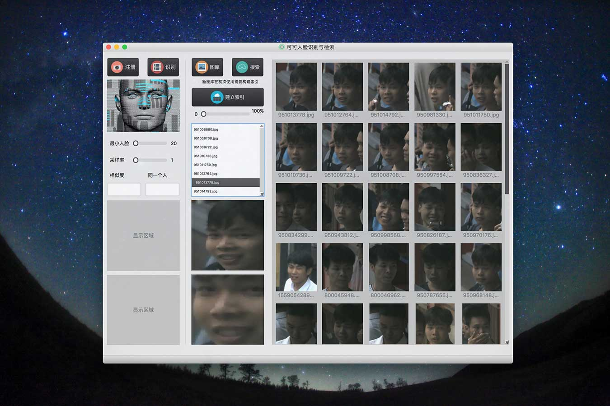

## SeetaFaceLib - A Face Image Retrieval System

### [中文简介](doc/README_Chinese.md)

## Introduction
SeetaFaceLib is a face image retrieval system based on [SeetaFaceEngine](https://github.com/seetaface/SeetaFaceEngine). The GUI of the QT project is designed as follows:

  

## Installation

The package of the SeetaFaceLib requires [SeetaFaceEngine]((https://github.com/seetaface/SeetaFaceEngine)), [Falconn](https://github.com/FALCONN-LIB/FALCONN) and Boost, and it has been tested on Mac OSX. SeetaFaceEngine and Falconn are included in the SeetaFaceLib, so you just need to install Boost. Besides, you need a QT environment to run the QT project.

## Technical

- LSH to make fast search
- reranking

## Demo

I have made a video demo. If you inerested in this project and want to know the performace of face image retrieval, you can access to the video: [Video Demo](https://yongyuan.name/project/)
